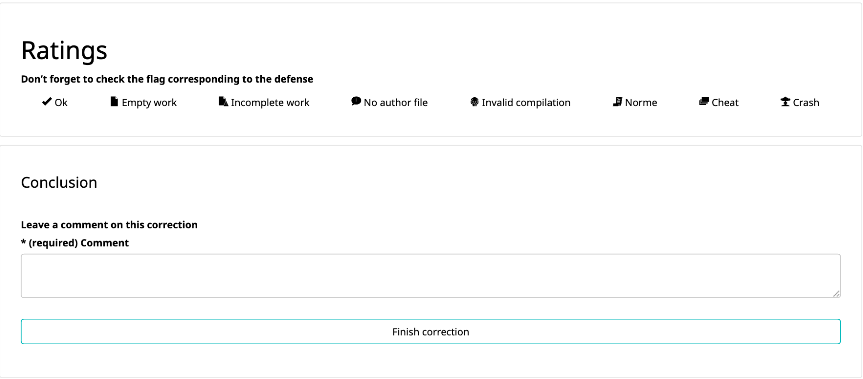

# Super file(s) transfert !!  
## Web project / Crypto  

**You**: - "I finish the plateform!!"  

**New BOOS**:  - "Super, let's see it !"  

## Corrections:

If any of these points are not true the correction stops
Name | Description / question
------------ | ------------- 
Server| must not: (access to content of data, access to fileNames, know numbers of files) 
Client | Only on the client the encryption/decryption is done

Name | Description / question | number of perc
------------ | ------------- | -------------
Navigator    | is it accessible with navigator ? | 4
server don't access | It is impossible to server or server's admin to decrypt data or metadata of file(s). Even in log  | 10
GIGA Byte| is it possible to send files with multiple giga octets ? The naviagtor's memory must not explose  | 8
Easy to user | Compatible: firefox 69 / chrome 77 / safari 13.0 ? Only one link is required for downloading. (no password to type) Attention if there is secret key in link, check if the secret key is sended to server   | 10
Crypto Library | Only native crypto library, and polyfill nodeJs native crypto are authorized. It is forbidden to re-code crypto algorythm. | 8  
Which algo crypt | Why you choose this algo ? check initialisation vector, Salt and password. Are they unique and random ? | 10
multile files | Can you send multiple files ? When you download, you receive a compressed archive of the sent files ? (archive.zip, archive.tar.gz)| 8  
Expire Date and download | The *owner can choose the time and number of download ?|8  
Corruption files | Check if there is a corruption of data the client is alerted|8
Owner view files | Owner can view file(s), how much downloads left and when download link expire  |8
Delete | Owner can delete files, check how authentification of owner works. Ex: if is it API Rest, send request delete even if you don't be the owner. | 8
Protection download/metaData | The Server, check if the client have secret key before send metaData or Files|  10
BONUS |SLIDER|0-25|  

