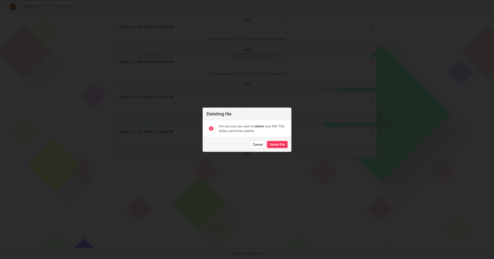

# Super file(s) transfert !!  
## Web project / Crypto  
  
### Summary:
Are you are lost ? It's not a big subject.
_____

## Mandatory  

**New BOSS**:  - "Welcome to our secure company !
We are super secure! We have forbidden USB keys. We have blocked all websites for file(s) transfer.
Yes, indeed we don't want to lose confidential document"  

**You**: - "Ok nice, but how to send file(s) ? by mail ?"  

**New BOSS**: - "No, never, because we could lose control of the file(s), and often the size limit of mails blocks us"  

**You**: "- So, how do we exchange file(s) with your clients? How do you transfer my work contract ? How can I send files to co-workers ?"  

**BOSS**: - "Very good questions! I hired you to answer these questions!"  

## Instructions  

We need a file transfer platform wich:
1. We can access with the web navigator  

2. The server, if there is any, must not be able to access the files wich are being sent.  
> If there is a server, the file(s) must be encrypted and the secret key should not be stored on the server or accessible in logs  

3. The files could have any size  
> Don't store all content of file(s) in RAM memory  
  
> 1 = before download starts  
> 2 = during download  
> The memory is never full  
  

4. The platform should be easy to use  
> We want just a download link. (no password to type)   
> *Warning: The server must not be able to access secret key, never send it to the server*  
> Compatible: firefox 69 / chrome 77 / safari 13.0

5. The transfer must be encrypted (client side) with good cryptography algorithm and with respect the following specs  
> - Only native crypto library, and polyfill nodeJs native crypto are authorized.  
> - It is forbidden to re-code crypto algorithm.  
> - Use good cryptographic practices,  
>   - Initialization vector must be unique, secret key mut be long and non previsible... (Are they unique and random ?!)  
>   - https://nvlpubs.nist.gov/nistpubs/Legacy/SP/nistspecialpublication800-38d.pdf  
>   - https://www.w3.org/TR/WebCryptoAPI/  

6. If you send multiple files, you create a TarBall and you compress it, or create a zip file.
> Warning server must not be able to know the number of files and filenames  
  
> Before download, user can view the number of files and filenames  
  

7. The owner* can set an expiration date and the maximum number of downloads  
>  
> When the download link expires or the number of downloads is 0, the file is removed from the server  

8. If there is a problem with the transfer (corruption of the file's content), the platform must control the file's integrity (client side)  
> If corruption is detected, the client app cancels the ongoing download and shows an error message  
  

9. The owner* can view his file(s). For each file, show number of downloads left and link's expiry date  
  
> When download link expire, the file(s) is removed from server  

10. Only the owner* of the file(s) can delete them  
  
> File must not exist anywhere on the server after the delete

11. The server checks if the client has the secret key before sending metaData or Files
> Warning! Don't send the secret key to the server  

12. If there is metadata on server. The metadata must be encrypted with another key than the files  

13. The content of the file must not be accessible even if a spy sees all the exchanges with the server. or if the server is hacked and all these data are stolen.  

**owner: the one who uploaded the file(s)*  
___

## Possible bonuses
1. The user can set a password for the uploaded file(s)  
    > It will be prompted when someone tries to download the file(s)  
    > The download link alone is not enough
2. Admin page:  
    - The admin can:  
        - Delete file(s)  
        - View number of all file(s) uploaded  
    - The admin cannot:  
        - View the content of the file(s)  
        - View names of the file(s)  
        - Know the secret key/ or password  
3. Rename file(s)s and archives*  
4. Progress bar on download/upload ;)  

*archive: is the file that will be downloaded by the client. It contains all the files sent.
(archive.zip or archive.tar.gz...)

> When the site is in production, your very nice **Boss** will give you an SSL certificate.  So all your exchanges will be in HTTPS. For convenience, the project does not need to set the https.  